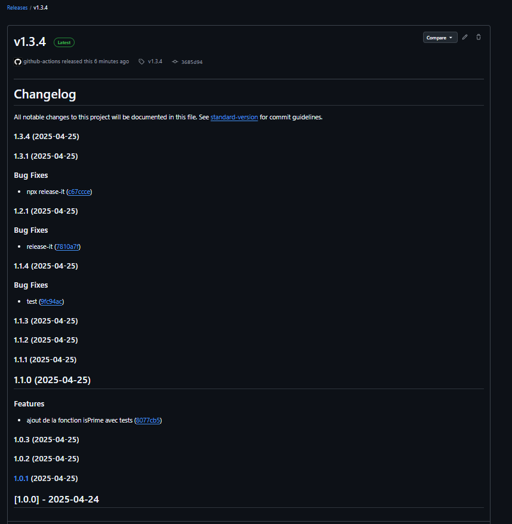

# Rapport de Publication

## 1. Liste des Outils Testés

### 1.1. **standard-version**
- **Description** : `standard-version` est un outil qui permet de gérer le versioning, le changelog, et les tags en suivant les conventions de commit (Conventional Commits).
- **Fonctionnalités** :
  - Incrémentation automatique de la version (major, minor, patch).
  - Génération du changelog basé sur les commits.
  - Création de tags Git.

### 1.2. **release-it**
- **Description** : `release-it` est un outil tout-en-un permettant de gérer les versions, changelogs, tags et publier les releases sur différentes plateformes comme GitHub.
- **Fonctionnalités** :
  - Incrémentation automatique de la version.
  - Publication des releases sur GitHub, GitLab, etc.
  - Génération du changelog.

### 1.3. **conventional-changelog**
- **Description** : `conventional-changelog` est un ensemble d'outils permettant de générer un changelog basé sur les messages de commit qui respectent les conventions des commits conventionnels.
- **Fonctionnalités** :
  - Génération du changelog à partir des commits conventionnels.
  - Facilité d'intégration dans un pipeline CI/CD.

---

## 2. Forces et Faiblesses de Chaque Outil

### 2.1. **standard-version**
- **Forces** :
  - Simple à utiliser et bien documenté.
  - Très intégré avec Git et respecte les bonnes pratiques de versionning sémantique (SemVer).
  - Génère un changelog de manière automatique et fiable.
- **Faiblesses** :
  - Ne prend pas en charge la publication automatique des releases sur des plateformes comme GitHub. Il faut faire cela séparément.
  - Moins flexible pour des cas d'utilisation complexes.

### 2.2. **release-it**
- **Forces** :
  - Outil tout-en-un pour gérer les versions, changelog, tags et publier directement sur GitHub.
  - Très configurable et flexible pour les projets plus complexes.
  - Interface en ligne de commande intuitive.
- **Faiblesses** :
  - Nécessite souvent une configuration initiale plus importante (ex: tokens d'authentification).
  - Peut parfois être difficile à configurer dans des workflows CI/CD complexes.

### 2.3. **conventional-changelog**
- **Forces** :
  - Outil très spécifique pour générer des changelogs à partir des commits conventionnels.
  - Intégration facile dans des pipelines CI/CD.
  - Permet d'assurer une bonne cohérence des messages de commit dans le projet.
- **Faiblesses** :
  - Ne gère pas directement le versioning ou la création des releases (ce n'est que pour la génération du changelog).
  - Nécessite que les commits respectent scrupuleusement la convention pour être efficace.

---

## 3. Capture d'Écran et Lien vers les Releases Publiées

### 3.1. **Capture d'Écran**

### 3.2. **Lien vers la Release Publiée**
- [Voir la release sur GitHub](https://github.com/MAXCOEUR/isPalindrome/releases/tag/v1.3.4)

---

## 4. Retour sur le Script Final

Le script `release.sh` a été configuré pour automatiser les étapes de publication de version et de génération de changelog. Il prend en charge deux outils : `standard-version` et `release-it`.

- **Processus Automatisé** : Le script permet de lancer des tests, de mettre à jour la version, de générer un changelog, de créer un tag Git, et de publier la release sur GitHub.
- **Améliorations** :
  - Ajouter la gestion des erreurs pour garantir que les étapes s'exécutent correctement.
  - Permettre l'intégration directe de `conventional-changelog` pour une meilleure gestion des messages de commit.

En résumé, chaque outil a ses avantages et inconvénients, et le choix entre eux dépendra des besoins spécifiques du projet. `release-it` est le plus complet pour automatiser toutes les étapes de publication, mais `standard-version` est plus simple à utiliser et bien adapté pour des projets plus petits. `conventional-changelog` se concentre uniquement sur la génération du changelog et est donc plus limité en termes de fonctionnalités de publication.

---

## Conclusion

- **Meilleur Outil pour un Projet Simple** : `standard-version`.
- **Meilleur Outil pour une Publication Automatisée Complète** : `release-it`.
- **Meilleur Outil pour une Gestion Cohérente des Commits** : `conventional-changelog`.

Le processus de publication est maintenant complètement automatisé, ce qui permet de gagner du temps et d'éviter les erreurs humaines lors des mises à jour de version.

---

